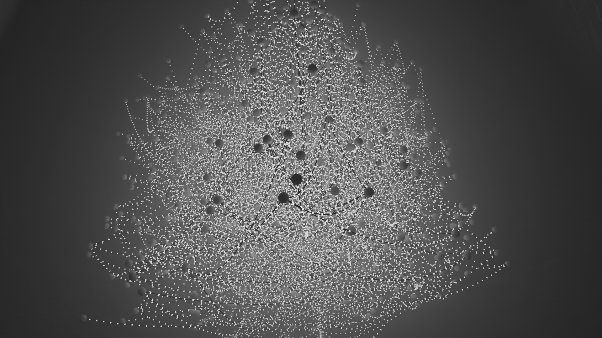

# Advent of Code 2025 Day 8 Parts 1 & 2

https://adventofcode.com/2025/day/8

This one actually took me all day, in awe of how poorly I understood graph
theory, just to learn hours upon hours later I had an integer overflow.

"Sure, looks like an unsigned integer can hold each axis coordinate" then starts
multiplying them and raising them to the power of two.

Part 2 was done by just making the algorithm run until there was only one
circuit left, then using the last two connected nodes. There is probably a
faster or more elegant solution.

The code uses cache tables to speed up searches and calculations. The `edges`
cache in particular used to be an array of `Edge` objects with `hi` and `lo`
indexes and it was... quite slow. A quick lookup table, with a `true` if two
nodes are connected, proved to be magnitudes faster!

The function `getNumberOfCircuits()` could be further improved by keeping track
of each ID's usage seperately in a lookup table, zero-ing it out in
`mergeCircuits()` as needed. 

This render was made in Blender using Geometry Nodes. There is an OBJ exporter
as a conditional compilation flag in `day08.d`.
